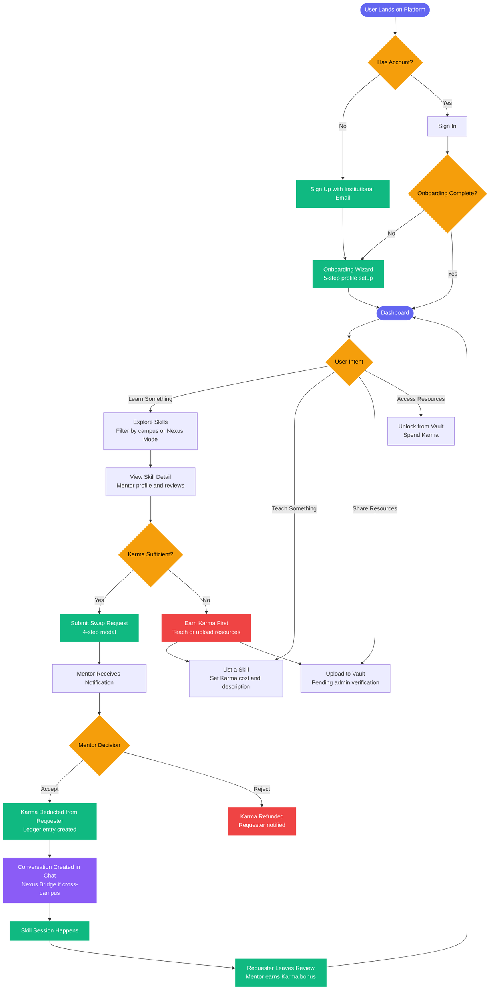
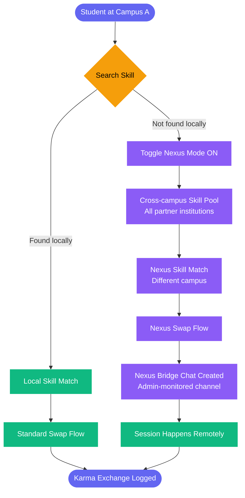
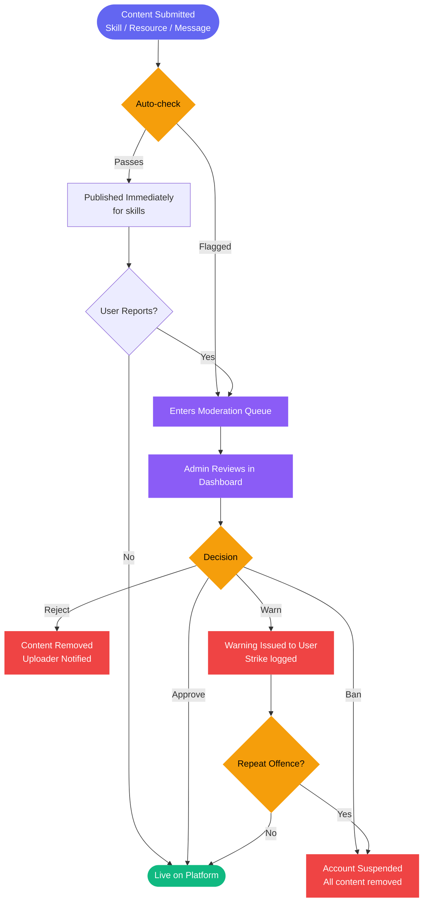

# EduSync

**Inter-campus peer-to-peer skill exchange platform powered by a Karma economy.**

EduSync connects students across partner universities to swap skills, share verified academic resources, and build a knowledge network that operates without money — using Karma as the medium of exchange.

> HackIndia 2026 · Team Error404

---

## The Problem

Indian engineering campuses are knowledge silos. A student struggling with VLSI at one institution has no structured way to reach a peer who aced the same subject at another. Paid tutoring platforms are inaccessible to most students. WhatsApp groups do not scale. The knowledge exists — the infrastructure to surface it does not.

EduSync is that infrastructure.

---

## Live Demo

**Deployed:** [edusync.vercel.app](https://openclaw-hackathon-hackindia-error4-six.vercel.app)  
**Design Doc:** [DESIGN_DOC.md](./DESIGN_DOC.md)

---

## Platform Workflow



---

## Karma Economy

The platform runs entirely on Karma — a non-monetary internal currency. No subscriptions, no payments, no barriers.


---

## Nexus Mode

Local campus discovery is the default. Nexus Mode expands the pool to all partner institutions — enabling cross-campus skill matching with admin-monitored communication channels.



---

## Admin Moderation Flow



---

## Tech Stack

| Layer | Technology |
|---|---|
| Frontend | React 18 + Vite 5 |
| Styling | Tailwind CSS v4 |
| Animations | Framer Motion v11 |
| State | Zustand |
| Data Fetching | TanStack React Query v5 |
| Backend / Auth | Supabase (PostgreSQL + Auth + Realtime + Storage) |
| Forms | React Hook Form |
| Notifications | Sonner |
| Icons | Lucide React |
| Deployment | Vercel |

---

## Database Schema

```
campuses          — partner institution registry
profiles          — extends auth.users with campus, role, karma_balance
skills            — skill listings created by mentors
skill_requests    — swap requests between students
skill_reviews     — post-session ratings and comments
resources         — uploaded PDFs, docs, links in the Knowledge Vault
resource_unlocks  — tracks which user unlocked which resource
karma_ledger      — full immutable transaction log of all karma movements
conversations     — chat threads (supports Nexus Bridge flag)
messages          — real-time messages within conversations
notifications     — in-app notification feed per user
reports           — content and user reports for moderation queue
```

All tables have Row Level Security (RLS) enabled. Karma transactions are atomic via Supabase RPC functions — no client-side race conditions.

---

## Project Structure

```
src/
├── pages/           — Landing, Login, Onboarding, Dashboard, Explore,
│                      SkillDetail, Vault, Chat, Admin, Profile, Settings
├── components/
│   ├── ui/          — Button, Card, Modal, Badge, Skeleton, EmptyState
│   ├── layout/      — RootLayout, Navbar, MobileBottomNav, ProtectedRoute
│   └── shared/      — SkillCard, ResourceCard, SwapRequestModal, KarmaChip
├── stores/          — Zustand: authStore, uiStore, onboardingStore
├── hooks/           — useAuth, useSkills, useKarma, useCountUp, useChat
├── services/        — Supabase query functions per domain
├── data/            — mockData.js (dev/demo, fictional campus names only)
└── lib/             — supabase.js, queryClient.js
```

---

## Navigation Logic

```
/ (Landing)
    └── /login
          ├── New user  → /onboarding (5-step wizard, runs once)
          │                    └── /dashboard
          └── Returning → /dashboard
                              ├── /explore
                              │     └── /explore/skill/:id
                              ├── /vault
                              ├── /chat
                              │     └── /chat/:conversationId
                              ├── /profile
                              │     └── /profile/:userId
                              ├── /notifications
                              ├── /settings
                              └── /admin  (role: admin only)
```

Route access is enforced in `ProtectedRoute.jsx`. Users without a completed onboarding profile are redirected to `/onboarding` regardless of the URL they attempt to access. Admin routes reject non-admin roles at the router level, not via CSS visibility.

---

## Local Setup

```bash
git clone https://github.com/ayushjhaa1187-spec/openclaw-hackathon-hackindia-error404.git
cd openclaw-hackathon-hackindia-error404
npm install
```

Create `.env.local` in the project root:

```
VITE_SUPABASE_URL=your_supabase_project_url
VITE_SUPABASE_ANON_KEY=your_supabase_anon_key
```

```bash
npm run dev
```

Run the SQL schema from `DESIGN_DOC.md` in your Supabase SQL editor before first use.

---

## Partner Campus Network

All campus names in this application are fictional and used for demonstration purposes only. No real institution is represented or implied.

| Short Code | Institution Name |
|---|---|
| NIT-N | Northvale Institute of Technology |
| DEU | Deccan Engineering University |
| VCST | Vistara College of Science & Tech |
| ITU | Indravali Technical University |
| SIAS | Sahyadri Institute of Advanced Studies |

---

## License

MIT — see [LICENSE](./LICENSE)

---

*HackIndia 2026 Submission · Team Error404*
